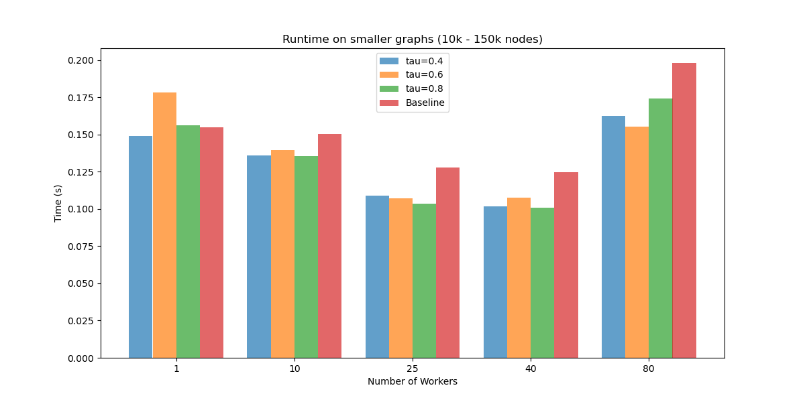
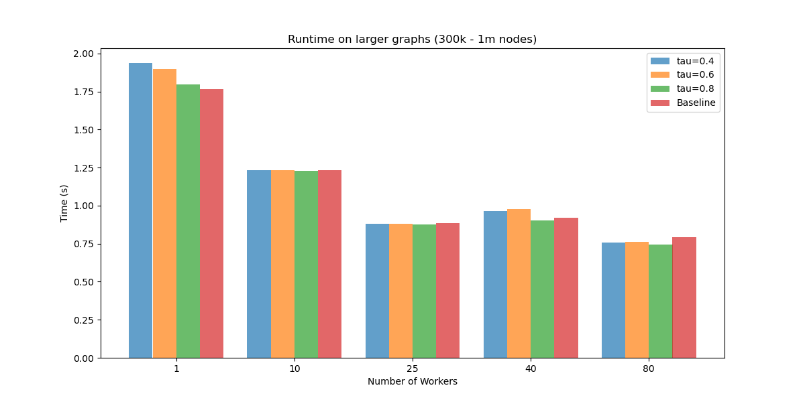
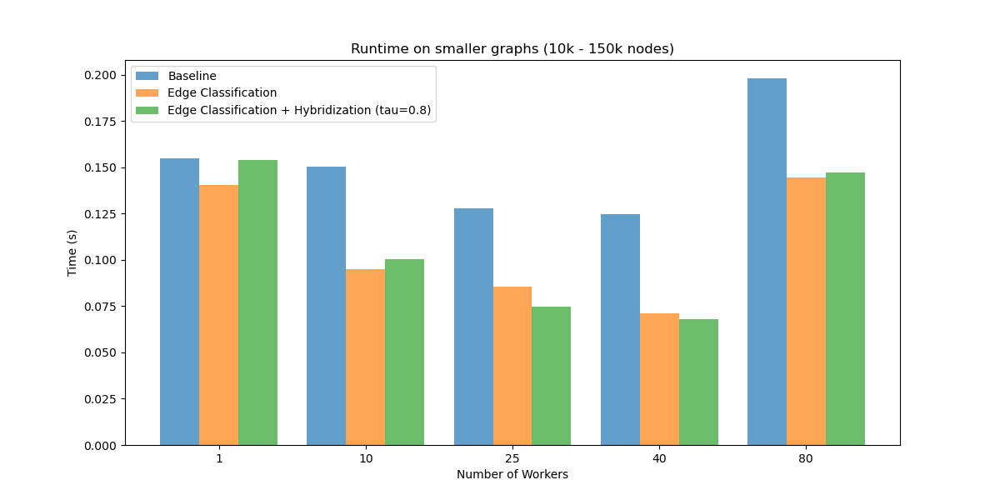
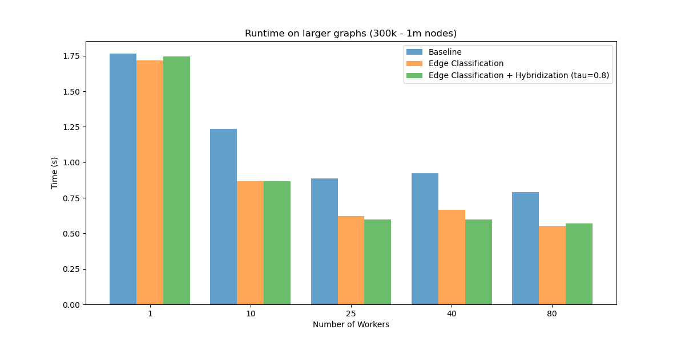
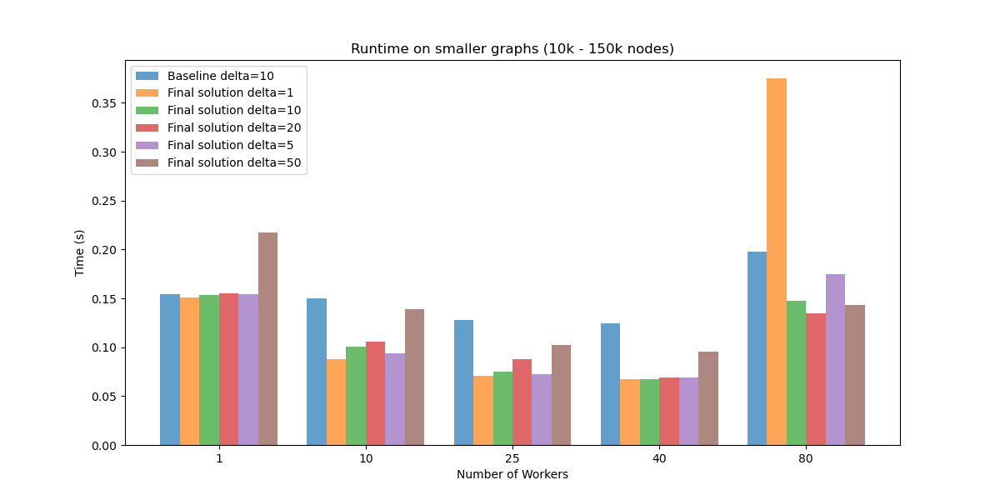
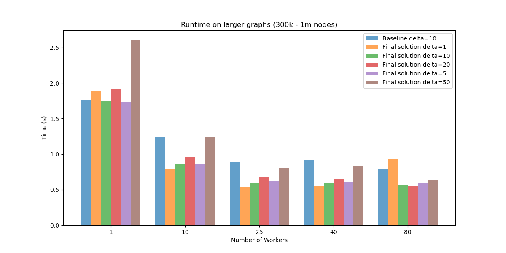

# HPC MPI project report

### Bartosz Szostakiewicz

## 1. Implementation

I have implemented the algorithm using the `MPI_Alltoallv` communication. I am storing the buckets in a `std::map<set::unordered_set<int>`, and in the `process_bucket` function I am first updating the distances and buckets of local nodes and preparing all the outer edge updates for sending. I am computing `next_bucket_index` and the number of settled vertices for the hybridization optimization using `MPI_Allreduce`. I am also using a simle `MPI_Barrier` in the edge classification version for simple synchronization.

I've implemented the optimization flags as constants that can be overriden during compilation like this `make "-DDELTA=10 -DEDGE_CLASSIFICATION=true -DHYBRIDIZATION=true -DTAU=0.8"`, those are the default values.

## 2. Optimization and benchmarks

I have generated graphs using the `RMAT-1` and `RMAT-2` models proposed in the paper. I divided them into 2 groups small `10k - 150k` vertices and `100k - 5m` edges and large `300k - 1m` vertices and `5m - 40m` edges.

I have benchmarked the solutions for `[1, 10, 25, 40 80]` workers. 

### 2.1 Hybridization

I compared Hybridization for `tau=[0.4, 0.6, 0.8]` and the baseline, with `tau=0.4` being the value recommended in the paper.

As we can see the Hybridization heuristic, provides higher efficiency gain in the smaller graphs anf the gain scales with the number of workers, which makes sense since the Bellman-Ford algorithm is better parallelizable.

In ther larger graphs we can see that smaller `tau` values sometimes lag behind, likely due to the overwhelming sheer number of relaxations. It is specially apparent in the 1 worker scenario, but here too it scales well with the number of workers. 

In conclusion the `tau` value should be chosen according to the graph size, smaller `tau` values are best for smaller graphs and, highrt `tau` values scale better with the problem size.

One more interesting thing is that in smaller graphs, for more workers, the cost of communication between so much workers outweights the gain, so it is slower than with a smaller number of workers.

### 2.2 Edge Classification

I've compared the baseline implementation with Edge classification and edge classification with hybridization.

On both smaller and larger graphs the optimization leads to a very high speedup (`20-50%`). Here also generally the more workers the better speedup we get (apart from the situations where we have too much workers).

## 3. Final solution

For the final solution I left both optimizations on with `tau=0.8` for Hybridization.

### 3.1 Delta tuning

I compared the solution with the baseline for different delta values from set `[1, 5, 10, 20, 50]`. The `delta=1` value corresponds to the Dijsktra's algorithm.

It seems that the higher the delta the better it scales with higher worker number, but it still looks like `10` is the best value for delta. As we can see Dijkstra (`delta=1`) performs very poorly for large number of workers, and a high `delta=50` performs poorly for a small number of workers.

### 3.2 Weak scaling

Runtimes and scaling for a graph generated with the same seed from `10k` to `80k` vertices.

| Num Workers | Runtime | Weak Scaling Efficiency | Scaled Speedup |
|-------------|---------|-------------------------|----------------|
|            1|     0.06|                      1.0|             1.0|
|           10|      0.1|                      0.6|             6.0|
|           25|      0.3|                      0.2|             5.0|
|           40|      0.5|                     0.12|             4.8|
|           80|      0.8|                    0.075|             6.0|
